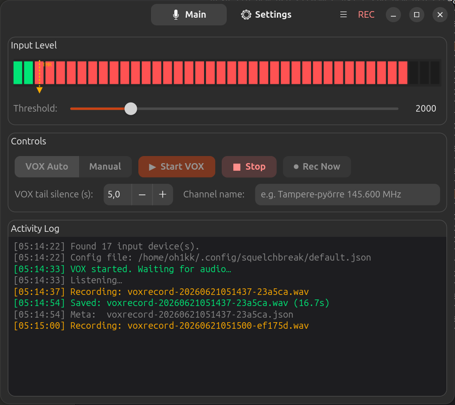

# Squelchbreak

A VOX-triggered audio recorder for amateur radio and scanner monitoring,
built with GTK4 + libadwaita for a native GNOME look.

**Homepage / source:** https://github.com/OH1KK/squelchbreak

Squelchbreak listens to an audio input device — typically a scanner or
transceiver's audio output feeding a USB sound card — and automatically
starts recording whenever the signal "breaks squelch" (exceeds a
configurable threshold), stopping again after a configurable period of
silence. Each recording is saved as a `.wav` file with a matching
`.json` metadata sidecar.

[](screenshots/main-window.png)

See [INSTALL.md](INSTALL.md) for setup instructions.

## Features

- **VOX Auto mode** — records automatically whenever audio crosses the
  threshold; stops after N seconds of silence
- **Manual mode** — monitor continuously, start/stop recording by hand
- **Visual input level meter** with a clear threshold marker, so you can
  see exactly where the trigger point sits relative to incoming audio
- **Per-recording metadata** — a `.json` sidecar with start/end time,
  duration, channel name, and anything else returned by an optional
  metadata script (e.g. querying a radio's current frequency over
  `rigctl` or a serial link)
- **Stuck-stream detection** — if a USB sound card freezes mid-session,
  Squelchbreak detects the stall and automatically reopens the audio
  stream rather than hanging silently
- **Multiple independent instances** — run one Squelchbreak process per
  radio/sound card, each with its own config file, so a problem with one
  radio's audio device can't affect the other (see below)
- **Native GNOME UI** — headerbar with a view switcher (Main / Settings),
  hamburger menu for config and device actions, toast notifications for
  save/load confirmation, and an Adwaita-styled preferences page that
  follows your system's light/dark theme

## Quick start

```bash
python3 run.py
```

This uses the default config file at `~/.config/squelchbreak/default.json`
(created automatically the first time you save settings).

1. Go to the **Settings** tab and pick your sound card, save directory,
   and filename prefix.
2. Back on **Main**, drag the threshold slider until the marker sits just
   above your usual background noise floor.
3. Click **Start VOX** (or switch to **Manual** mode and click
   **Monitor**, then **Rec Now** to record on demand).
4. Recordings land in your chosen save directory as
   `<prefix>-<timestamp>-<id>.wav` + `.json`.

## Running multiple radios at once

Each Squelchbreak window can load a different config file via
`--config`, and each running instance is a fully independent OS process
— if one process or sound card misbehaves, it can't take down the
other radio's recording session.

```bash
python3 run.py --config ~/.config/squelchbreak/radio1.json &
python3 run.py --config ~/.config/squelchbreak/radio2.json &
```

Each config file remembers its own:

- Sound card (matched by name, so USB re-enumeration after a replug
  doesn't lose your selection)
- Save directory and filename prefix
- VOX threshold and tail-silence duration
- Channel name (written into the `.json` sidecar)
- Metadata script
- Audio processing options (normalize / trim / padding)
- VOX vs. Manual mode

The window title bar always shows which config file is currently
loaded, so it's easy to tell two open windows apart.

You can switch a running window to a different config at any time via
the hamburger menu → **Open Config…**, or save the current settings to
a new file via **Save Config As…** — handy for setting up a second
radio's config based on the first one's settings.

## Metadata scripts

Point Settings → Metadata Script at any executable. It's run just before
each recording starts, and its standard output is expected to be a JSON
object, merged into that recording's `.json` sidecar:

```python
#!/usr/bin/env python3
import json
# Query your radio here, e.g. via rigctl or a serial interface
print(json.dumps({
    "frequency": 145500000,
    "mode": "NFM",
    "squelch": -80
}))
```

Make it executable (`chmod +x`) and select it in Settings. Use the
**Test script now** button to verify the output without starting a full
recording.

## Issues and contributions

Bug reports, feature requests, and pull requests are welcome at
https://github.com/OH1KK/squelchbreak/issues

## License

GNU GPL v3 or later. Copyright (C) 2015-2026 Kari Karvonen, OH1KK.
